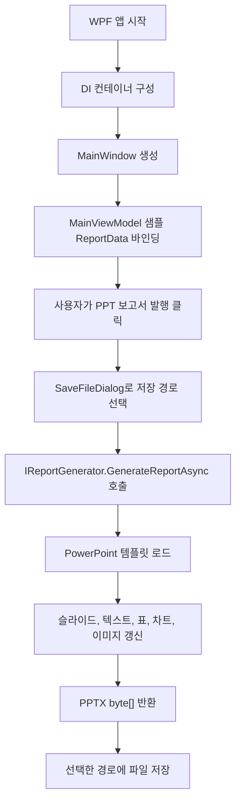

# TAD Report Module 프로젝트 분석

## 1. 프로젝트 개요

이 프로젝트는 테스트 실행 결과 데이터를 PowerPoint 보고서(`.pptx`)로 자동 생성하는 .NET 8 기반 모듈입니다. 전체 구조는 WPF 데스크톱 앱, 순수 도메인 모델, PowerPoint 생성 인프라, xUnit 테스트 프로젝트로 분리되어 있습니다.

핵심 목적은 `ReportData` 집계 데이터를 입력받아 사전에 준비된 `assets/tad_report_template.pptx` 템플릿의 플레이스홀더, 표, 차트, 이미지 영역을 Open XML로 갱신한 뒤 PPTX 바이너리를 생성하는 것입니다.

## 2. 기술 스택

| 영역 | 사용 기술 |
| --- | --- |
| 런타임 | .NET 8 |
| 언어 | C# 12 |
| UI | WPF |
| UI 패턴 | MVVM |
| DI | Microsoft.Extensions.DependencyInjection |
| MVVM 지원 | CommunityToolkit.Mvvm |
| PPTX 처리 | DocumentFormat.OpenXml |
| 이미지 처리 | SixLabors.ImageSharp |
| 테스트 | xUnit |

공통 빌드 설정은 `src/Directory.Build.props`에서 관리하며, `Nullable`, `ImplicitUsings`, `LangVersion 12`를 활성화하고 빌드 산출물을 `src/artifacts` 아래로 통합합니다.

## 3. 디렉터리 구조

```text
tad-report-module/
├── assets/
│   ├── company_logo.png
│   └── tad_report_template.pptx
├── docs/
│   ├── deployment-guide.md
│   ├── design_guide.md
│   ├── export-report-customization-guide.md
│   ├── optimization-change-log.md
│   ├── powerpoint_template_layout.png
│   ├── project-analysis.md
│   └── winforms-integration-guide.md
├── report-specification.md
└── src/
    ├── Directory.Build.props
    ├── TAD.Report.sln
    ├── TAD.Report.Core/
    ├── TAD.Report.Infrastructure.PowerPoint/
    ├── TAD.Report.WinFormsAdapter/
    ├── TAD.Report.App.WPF/
    └── TAD.Report.Tests/
```

현재 `bin`, `obj`, `artifacts` 산출물도 작업 폴더 안에 존재합니다. 소스 분석 시에는 이 산출물보다 `*.cs`, `*.csproj`, 문서, `assets`가 주요 대상입니다.

## 4. 솔루션 구성

### TAD.Report.Core

도메인 모델과 보고서 생성 인터페이스를 담는 순수 계층입니다. 외부 NuGet 의존성이 없으며 UI나 PPTX 구현을 알지 않습니다.

주요 타입은 다음과 같습니다.

| 파일 | 역할 |
| --- | --- |
| `Models/ReportData.cs` | 보고서 생성 입력 루트 집계 |
| `Models/TestCaseResult.cs` | 테스트 케이스 단위 결과 |
| `Models/DailyTrend.cs` | 일자별 Pass/Fail 추이 |
| `Interfaces/IReportGenerator.cs` | 보고서 생성 추상화 |
| `Result.cs` | 성공/실패를 표현하는 공통 결과 타입 |

`ReportData`는 `Total`, `Pass`, `Fail`, `Rate` 계산 프로퍼티를 제공합니다. `Pass`와 `Fail` 계산은 대소문자를 무시하므로 `"pass"`, `"Pass"`, `"PASS"` 입력을 동일하게 처리합니다.

### TAD.Report.Infrastructure.PowerPoint

Open XML 기반 PPTX 생성 구현체를 담는 계층입니다. `IReportGenerator`를 구현하는 `PowerPointReportGenerator`가 핵심입니다.

주요 책임은 다음과 같습니다.

- 템플릿 PPTX 파일 로드
- 실패 케이스 수에 따라 Failure Detail 슬라이드 복제 또는 제거
- 텍스트 플레이스홀더 치환
- 실패 스크린샷 이미지 삽입 및 비율 유지 리사이즈
- PPTX 템플릿 필수 구조 검증
- 회사 로고 삽입
- 테스트 케이스 테이블 동적 생성
- 요약 파이 차트와 일자별 추이 라인 차트 데이터 갱신

디자인 값은 `Constants/DesignGuide.cs`에 상수로 모아져 있으며, `docs/design_guide.md`의 색상, 폰트, 좌표 규칙을 코드로 반영합니다.

### TAD.Report.App.WPF

사용자가 샘플 데이터를 확인하고 PPT 보고서를 저장할 수 있는 WPF 앱입니다.

앱 시작 시 `App.xaml.cs`에서 DI 컨테이너를 구성합니다.

- `IReportGenerator` -> `PowerPointReportGenerator`
- `MainViewModel`
- `MainWindow`

`MainViewModel`은 디자인 타임 샘플 `ReportData`를 생성하고, `SaveFileDialog`를 통해 저장 경로를 받은 뒤 `IReportGenerator.GenerateReportAsync`를 호출합니다. 생성된 PPTX 바이너리는 `File.WriteAllBytesAsync`로 저장됩니다.

`MainWindow.xaml`은 테스트 케이스 목록을 `DataGrid`로 표시하고, 하단의 `PPT 보고서 발행` 버튼을 통해 내보내기를 실행합니다.

### TAD.Report.WinFormsAdapter

WinForms 기반 본 프로젝트에서 WPF 앱 없이 보고서 생성 기능을 호출하기 위한 선택형 어댑터입니다.

주요 구성은 다음과 같습니다.

| 파일 | 역할 |
| --- | --- |
| `ReportExportOptions.cs` | 템플릿/로고 경로와 SaveFileDialog 기본값 |
| `ReportExportService.cs` | UI와 무관한 PPTX 생성 및 파일 저장 facade |
| `WinFormsReportExporter.cs` | WinForms `SaveFileDialog`, `MessageBox`를 포함한 편의 API |

본 프로젝트가 WinForms라면 `TAD.Report.App.WPF` 대신 `TAD.Report.WinFormsAdapter`, `TAD.Report.Core`, `TAD.Report.Infrastructure.PowerPoint`를 참조하는 구성이 적합합니다.

### TAD.Report.Tests

xUnit 기반 테스트 프로젝트입니다. 현재 테스트는 크게 두 가지를 확인합니다.

- `ReportData` 계산 필드(`Total`, `Pass`, `Fail`, `Rate`) 검증
- `PowerPointReportGenerator.GenerateReportAsync` 호출 결과가 성공이면 바이너리가 비어 있지 않은지 검증

## 5. 주요 실행 흐름



## 6. PowerPoint 생성 상세

`PowerPointReportGenerator`는 템플릿의 슬라이드 순서를 전제로 동작합니다.

| 인덱스 | 의미 |
| --- | --- |
| 0 | 표지 |
| 1 | 종합 요약 |
| 2 | 실패 상세 템플릿 |
| 3 | 테스트 리스트 |
| 4 | 일자별 추이 |

실패 케이스가 없으면 실패 상세 슬라이드를 제거합니다. 실패 케이스가 여러 개면 원본 템플릿에서 실패 상세 슬라이드를 추가 복제합니다. 이후 실패 슬라이드 개수에 따라 테스트 리스트와 추이 차트 슬라이드 인덱스를 다시 계산합니다.

텍스트 치환 대상은 다음과 같습니다.

| 플레이스홀더 | 값 |
| --- | --- |
| `{{TITLE}}` | `ReportData.Title` |
| `{{DATE}}` | `ReportData.Date` |
| `{{TOTAL}}` | `ReportData.Total` |
| `{{PASS}}` | `ReportData.Pass` |
| `{{FAIL}}` | `ReportData.Fail` |
| `{{RATE}}` | `ReportData.Rate` |
| `{{NAME}}` | 실패 테스트 이름 |
| `{{DESC}}` | 실패 설명 |

차트는 템플릿 내 ChartPart를 찾아 리터럴 데이터로 값을 갱신합니다. 표는 기존 템플릿 행을 복제하거나 합성 행을 만든 뒤 `TestCases` 목록을 순회해 동적으로 채웁니다.

## 7. 현재 구현 상태 평가

구현은 명세의 주요 항목을 대부분 반영하고 있습니다.

- Core 계층은 UI/PPTX 의존성 없이 분리되어 있습니다.
- WPF 앱은 DI와 MVVM 구조를 사용합니다.
- WinForms 본 프로젝트 통합을 위한 별도 어댑터가 제공됩니다.
- PPTX 생성기는 템플릿 기반 Open XML 조작을 수행합니다.
- 실패 슬라이드 동적 복제, 테이블 생성, 차트 갱신, 로고 삽입이 구현되어 있습니다.
- 템플릿 필수 구조 검사와 깨진 이미지 바이트 방어가 구현되어 있습니다.
- 디자인 가이드 색상과 좌표가 상수화되어 있습니다.
- 기본 xUnit 테스트 프로젝트가 존재합니다.

다만 로깅, 설정 외부화, 템플릿 세부 검증 측면에서는 보강 여지가 있습니다.

## 8. 주의할 점 및 리스크

### 템플릿 구조 의존성

생성기는 여전히 슬라이드 인덱스 기반 템플릿 규약을 사용하지만, 생성 시작 시 필수 슬라이드 수, placeholder, 차트, 테이블 존재 여부를 검사합니다. 템플릿 구조가 크게 바뀌면 조용히 잘못된 결과를 만들기보다 실패 메시지를 반환하도록 개선되었습니다.

### 이미지 유효성

실패 스크린샷과 회사 로고는 ImageSharp로 실제 이미지 로드를 수행합니다. 현재는 이미지가 아닌 바이트가 들어오면 해당 이미지 삽입만 건너뛰고 PPTX 생성은 계속 진행합니다.

### 테스트 검증 강도

테스트는 생성 성공 여부를 명시적으로 단언하며, placeholder 치환, 실패 슬라이드 복제/제거, 이미지 실패 방어, Pass/Fail 대소문자 처리를 함께 검증합니다.

### PASS/FAIL 대소문자 처리

`ReportData.Pass`, `ReportData.Fail`, `PowerPointReportGenerator`의 실패 필터와 결과 셀 스타일링은 모두 대소문자 무시 기준으로 동작합니다.

### 운영 지침 미구현 항목

`report-specification.md`의 Enterprise Production Guidelines에는 `ILogger`, `appsettings.json`, `IOptions<T>` 사용이 언급되어 있지만 현재 구현에는 아직 반영되어 있지 않습니다.

## 9. 개선 제안

1. PPTX 템플릿 유효성 검사 확장
   - 현재 필수 슬라이드 수, 주요 차트, 표, placeholder를 검사합니다. 필요하면 개체 이름, 표 컬럼명, 차트 계열명까지 검사 범위를 넓힐 수 있습니다.

2. 테스트 데이터 이미지 개선
   - 현재는 실제 `company_logo.png`를 테스트 이미지 바이트로 사용합니다. 장기적으로는 테스트 전용 PNG 생성 헬퍼를 두면 로고 파일 변경과 테스트 의존성을 분리할 수 있습니다.

3. 생성 결과 PPTX 구조 테스트 확장
   - 생성된 byte 배열을 다시 `PresentationDocument`로 열어 슬라이드 수와 텍스트 치환은 검증합니다. 추가로 차트 데이터, 테이블 행 수, 이미지 개체 이름까지 검증할 수 있습니다.

4. 결과 문자열 표준화
   - 대소문자 처리 기준은 통일되었지만, 장기적으로는 `PASS`, `FAIL` 문자열을 enum 또는 상수로 관리하는 것이 안전합니다.

5. 로깅/설정 외부화 적용
   - 운영 사용을 고려한다면 템플릿 경로, 로고 경로, 디자인/레이아웃 일부를 옵션으로 분리하고 `ILogger`를 주입하는 방향이 좋습니다.

6. UI 데이터 입력 기능 확장
   - 현재 WPF 앱은 샘플 데이터 기반 내보내기에 가깝습니다. 실제 사용 시 JSON/CSV/테스트 결과 파일 불러오기 기능이 있으면 독립 도구로 활용도가 커집니다.

## 10. 빌드 및 실행

솔루션 루트는 `src`입니다.

```powershell
cd C:\Workspace\tad-report-module\src
dotnet build TAD.Report.sln
dotnet test TAD.Report.sln
dotnet run --project TAD.Report.App.WPF\TAD.Report.App.WPF.csproj
```

WPF 프로젝트는 Windows 전용 `net8.0-windows`를 대상으로 하므로 Windows 환경에서 실행해야 합니다.

## 11. 요약

이 프로젝트는 테스트 결과를 회사 지정 PowerPoint 템플릿에 자동 바인딩하는 보고서 생성 모듈입니다. 구조는 Core, Infrastructure, WPF App, Tests로 잘 분리되어 있으며, 현재 구현은 명세의 핵심 기능을 대부분 포함합니다.

가장 중요한 향후 과제는 로깅과 설정 외부화, 그리고 템플릿 세부 규약을 더 명확한 계약으로 만드는 것입니다. 현재 기본 생성 흐름과 주요 회귀 시나리오는 테스트로 보호됩니다.
